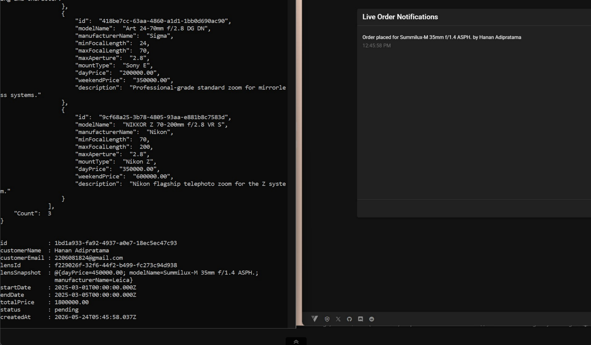
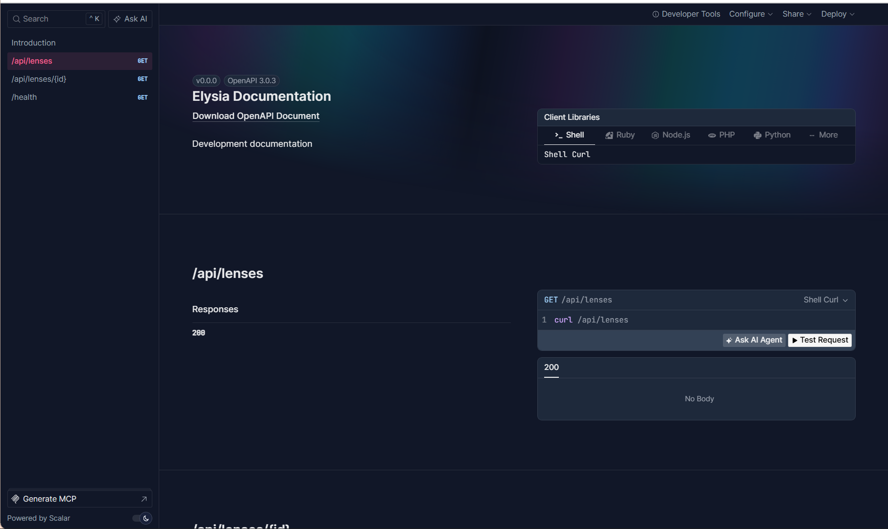
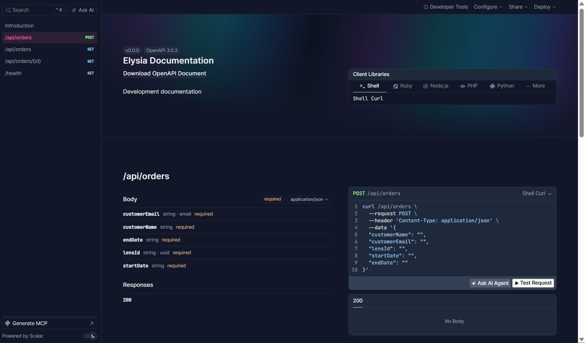
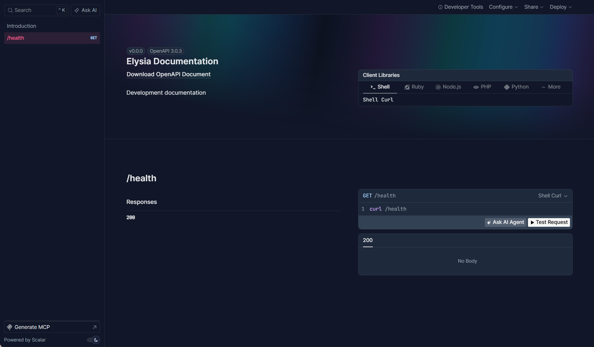
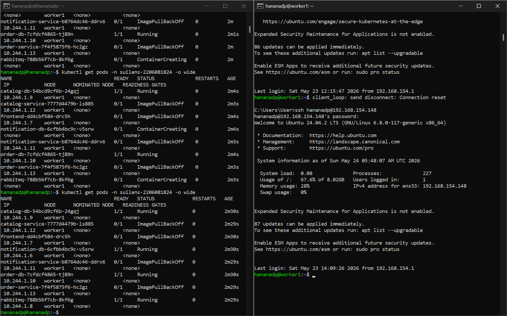

## Screenshot Websocket

## Screenshot OpenAPI Documentation

## Screenshot command kubectl

## Penjelasan Scaling dengan 2 Worker Node (Tugas A03)

Berdasarkan spesifikasi tugas, jika klaster ini memiliki **2 Worker Node** (misal `worker1` dan `worker2`), maka skenario *scaling* yang terjadi adalah sebagai berikut:
1. **Distribusi Beban Kerja (Load Balancing & Scheduling)**: Saat kita men-*deploy* aplikasi menggunakan *Deployment* Kubernetes (seperti `catalog-service`, `order-service`, dll) dengan jumlah replika (*replicas*) lebih dari 1, Kubernetes *Scheduler* pada Control Plane akan mendistribusikan *Pods* secara otomatis dan merata melintasi kedua *worker node* tersebut berdasarkan ketersediaan CPU dan RAM di masing-masing mesin. 
2. **High Availability**: Jika seandainya `worker1` mengalami mati listrik atau kendala teknis sehingga statusnya menjadi `NotReady`, aplikasi SuiLens tidak akan lumpuh seluruhnya. Kubernetes akan secara otomatis mendeteksi kegagalan tersebut dan memindahkan (menjadwalkan ulang / *reschedule*) *Pods* yang mati di `worker1` untuk berjalan di `worker2`. Ini memastikan aplikasi tetap dapat diakses oleh pengguna tanpa henti.
3. **Peningkatan Kapasitas Resource**: Dengan 2 *worker node*, total kapasitas RAM dan CPU klaster menjadi gabungan dari keduanya. Jika *traffic* pengguna melonjak tinggi, kita dapat mengatur **Horizontal Pod Autoscaler (HPA)** untuk menambah jumlah *Pods* hingga maksimal batas *resource* dari kedua server tersebut, hal yang tidak bisa dicapai jika hanya bergantung pada keterbatasan 1 server.
